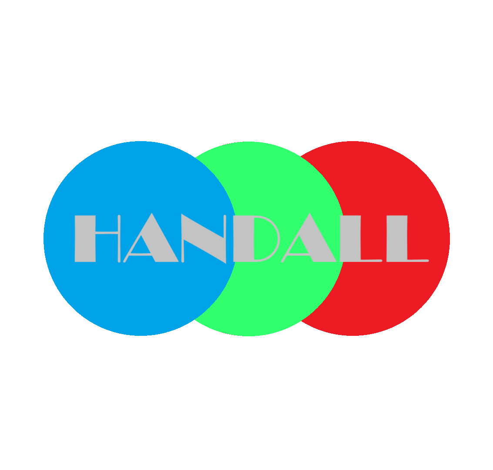
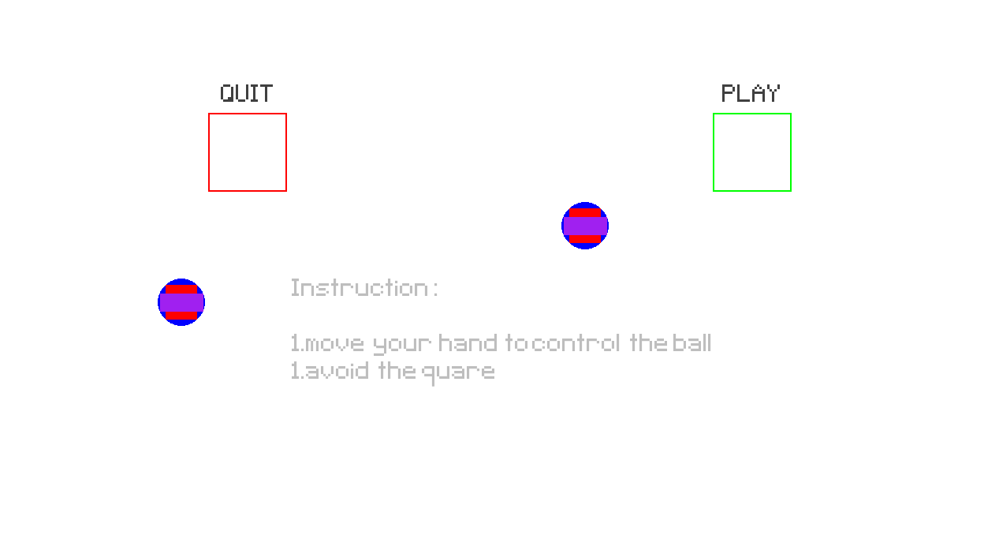

<div align="center">
  
  <h1>Handal</h1>
  <p>an interactive game for upper limbs exercises utilizing hand tracking.</p>

  
</div>

<div align="center">
  
</div>


https://github.com/user-attachments/assets/58ab909e-1a65-40aa-b03b-d675e8617d84


## Features

- 🎲 "Fun and engaging" gameplay
- 💻 real time hand tracking
- 💯 A score system?!?
- ⚔️ A myriad of obstacle types
- 👋 100% hand control, no need for keyboard
- 📸 AAA graphics
- 🎯 exercise while having fun
- ⚙️📈🗿 minimalism UI


## Development

### Prerequisites

- opencv-python
- pygame
- mediapipe

### Setup

```bash
# Install requirements 
pip install -r requirements.txt
```
and run the code
